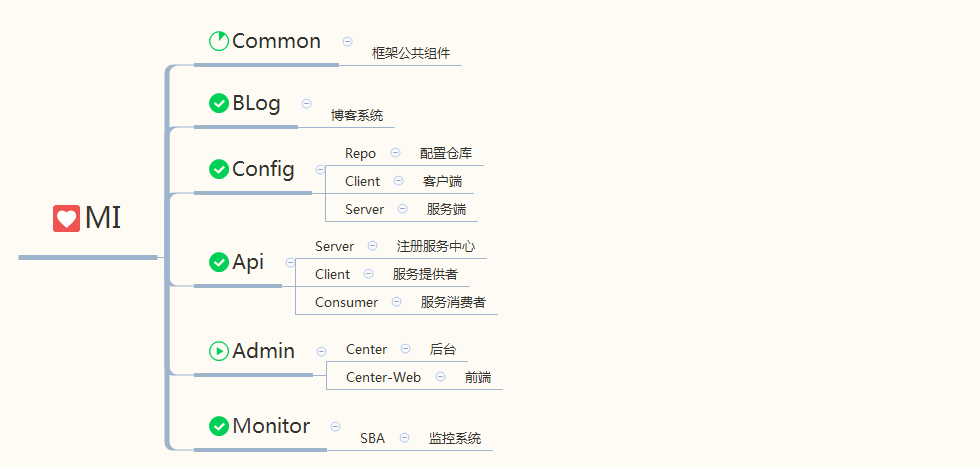
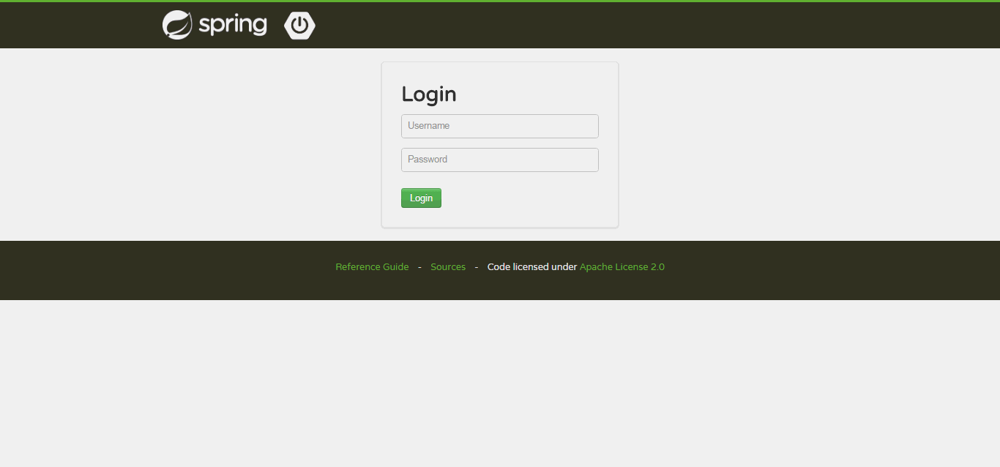
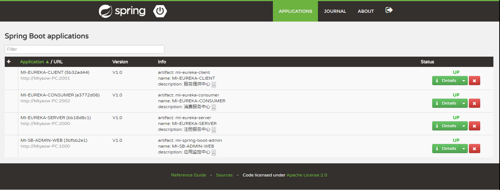
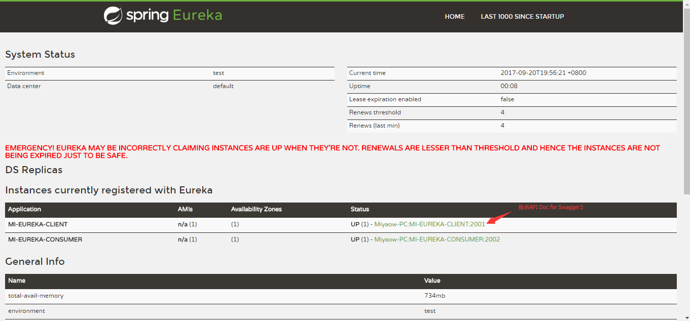
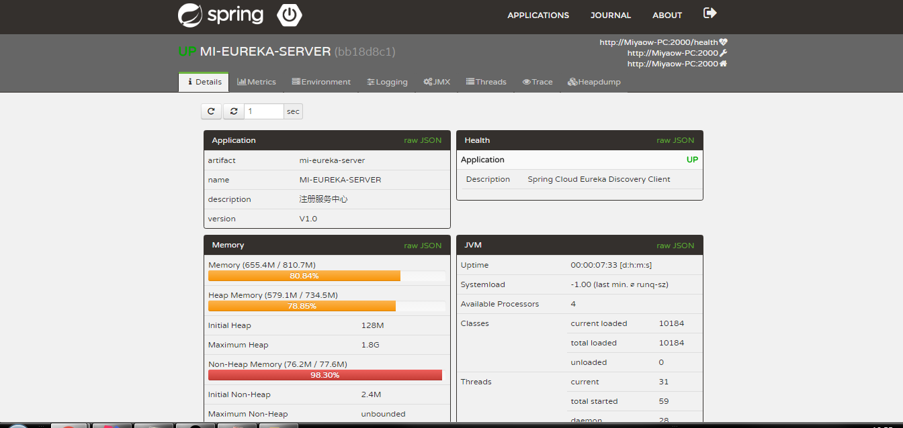
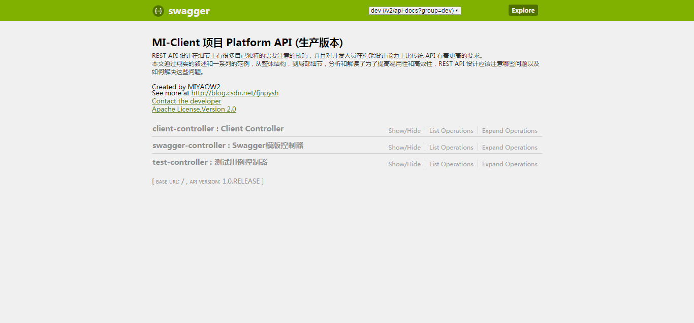
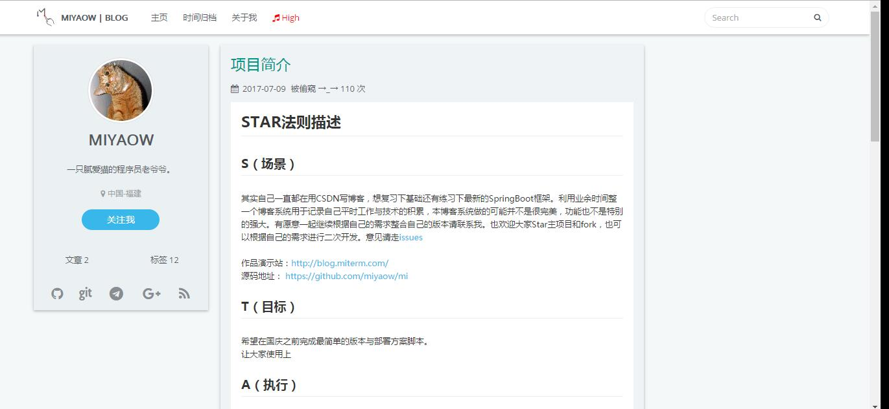
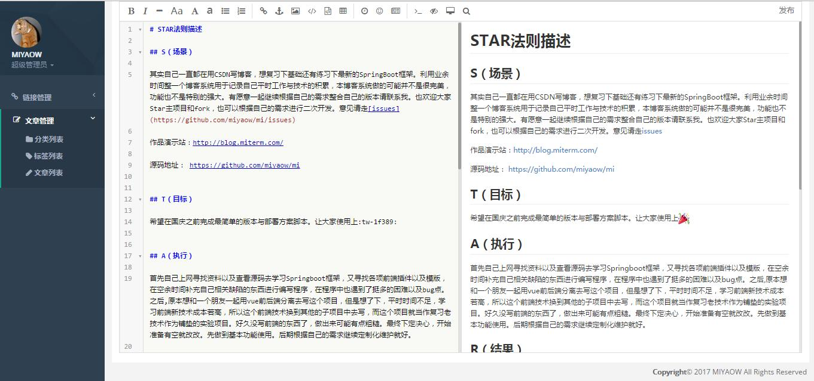

# [MI-S](https://github.com/MIYAOW/MI-S)

技术交流群：ⓕ-386423880[福建区](https://jq.qq.com/?_wv=1027&k=517NHmC)

## 作者前言

   本人非技术大牛，业余时间较少。但是保证不定期更新。若有较好的意见或者建议提问到ISSUES，联系方式见点击上边的License即可。

## 项目规划

   `MI`微型系统项目于2017年4月1日按照自主研发习惯归纳总结出一套企业级架构，并仅仅只是架构，它是一种理念，宛若一个大树，
   正在成长中.....

## 项目介绍

　　基于 **Spring Boot** + **Spring Cloud** + **Mybatis** 为主流框架搭建的分布式敏捷开发系统架构，为中、小型项目打造企业级基础开发多种解决方案。

#### 项目结构图解（打勾表示案例可用）

#### 项目模块简介

> mi-common

框架公共模块，提供相关共用工具类，以及代码生成器，基础配置参数，静态变量等,可**演变成公司专用工具类自行维护**。

> mi-blog [查看部署](https://github.com/MIYAOW/MI-S)

技术博客项目（使用HEXO主题模版，仿DD样式）

> mi-config

分布式统一配置管理中心，可解决多环境多项目配置

> mi-api

接口总线服务，提供eureka注册中心。其他模块需暴露API接口可参考此案例或者在自己子项目中创建服务提供者供其他项目调用消费。

> mi-admin

平台总管理，以及总平台管理中心功能。

## 技术选型

#### 前端技术
技术 | 名称 | 官网
----|------|----
Editor.md | Markdown编辑器  | [https://github.com/pandao/editor.md](https://github.com/pandao/editor.md)
Select2 | 选择框插件  | [https://github.com/select2/select2](https://github.com/select2/select2)
jqPaginator | jQuery分页组件  | [http://jqpaginator.keenwon.com/](http://jqpaginator.keenwon.com/)
Thymeleaf | 模板引擎  | [http://www.thymeleaf.org/](http://www.thymeleaf.org/)
Velocity | 模板引擎  | [http://velocity.apache.org/](http://velocity.apache.org/)
FontAwesome | 图标CSS分类参考 | [http://www.yeahzan.com/fa/facss.html](http://www.yeahzan.com/fa/facss.html)
H+ | 后台UI模版 | [http://www.zi-han.net/theme/hplus/](http://www.zi-han.net/theme/hplus/)
SweetAlert | 提示框优化（中文） | [http://mishengqiang.com/sweetalert/](http://mishengqiang.com/sweetalert/)

#### 后端技术
技术 | 名称 | 官网
----|------|----
Spring Boot | 微框架  | [https://projects.spring.io/spring-boot/](https://projects.spring.io/spring-boot/)
Spring Cloud | 微服务构架（中文）  | [https://springcloud.cc/](https://springcloud.cc/)
Spring Boot Admin | 应用监控中心V1.5.0  | [http://codecentric.github.io/spring-boot-admin/1.5.0/](http://codecentric.github.io/spring-boot-admin/1.5.0/)
Spring Security | 安全框架  | [http://projects.spring.io/spring-security/](http://projects.spring.io/spring-security/)
Maven | 项目构建管理  | [http://maven.apache.org/](http://maven.apache.org/)
Redis | 分布式缓存数据库  | [https://redis.io/](https://redis.io/)
Eureka | 云端服务发现  | [https://springcloud.cc/spring-cloud-netflix-zhcn.html/](https://springcloud.cc/spring-cloud-netflix-zhcn.html/)
Swagger2 | API文档框架  | [http://swagger.io/](http://swagger.io/)
MyBatis | ORM框架  | [http://www.mybatis.org/mybatis-3/zh/index.html/](http://www.mybatis.org/mybatis-3/zh/index.html/)
MyBatis Generator | 代码生成  | [http://www.mybatis.org/generator/index.html/](http://www.mybatis.org/generator/index.html/)
MyBatis-Plus | Mybatis增强工具包  | [http://mp.baomidou.com/#//](http://mp.baomidou.com/#//)
Druid | 数据库连接池 | [https://github.com/alibaba/druid/](https://github.com/alibaba/druid/)
Log4J | 日志组件 | [https://logging.apache.org/log4j/2.x/](https://logging.apache.org/log4j/2.x/)
Lombok | 代码消除冗长 | [https://projectlombok.org/](https://projectlombok.org/)
Jenkins | 持续集成工具 | [https://jenkins.io/index.html/](https://jenkins.io/index.html/)

## 环境搭建

#### 开发工具
- **IntelliJ IDEA Version(2017.1)**
- **MySQL** 
- **Navicat**
- **Microsoft Visio**
- **Power Designer**
- **Git**
- **Nginx**

#### 配置环境
 
- **Jdk 8**
- **Redis**
- **Mysql5.5 ↑**

## 项目案例图示

### API 模块预览图
#### SBA

#### Eureka

#### Swagger2

### MI-BLog 模块预览图

#### 首页展示部分

#### 文章详情页

#### 后端总览界面

#### markdown编辑器

## 许可证

[MIT](https://github.com/MIYAOW/MI/blob/master/LICENSE "MIT") ☞ [明白更多](http://ovr5hz4v2.bkt.clouddn.com/licenses/MIT.jpg "MIT")

`部分资源请勿用商业用途`

## 感谢赞助

